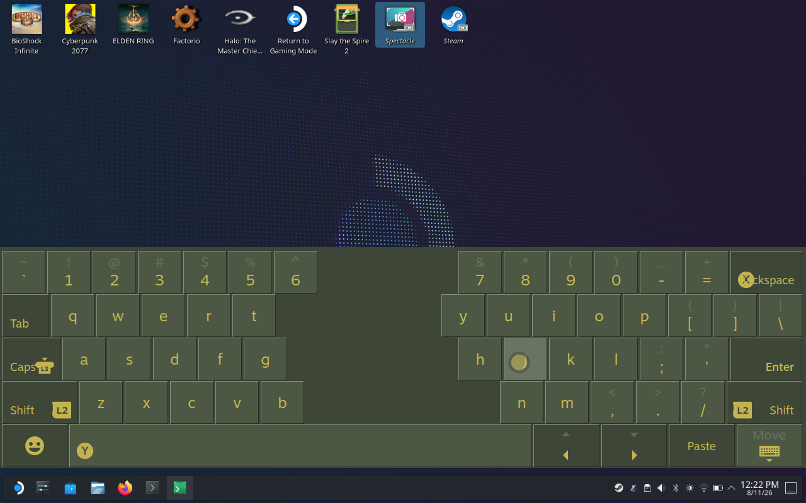

# AI Slop Split Thumb Keyboard



This repository is the reproducible source for the locally installed theme. It
preserves the final accepted state:

- smaller keys split into left and right clusters;
- a real center gap created with flexbox auto margins;
- visually even horizontal and vertical spacing between painted key faces;
- untouched nested button icons;
- Steam's native vertical position and unobstructed bottom menu bar.

It also contains the tested CSS Loader 2.1.2 browser-hook snapshot that reduces
delayed theme injection into newly opened keyboard windows.

## Reinstall

Install Decky Loader and CSS Loader first, then run:

```bash
cd /home/deck/Split-Thumb-Keyboard
./install.sh
```

The script installs and enables the theme. It installs the reliability snapshot
only when the detected CSS Loader version is exactly 2.1.2; other versions are
left alone. Use `./install.sh --theme-only` to skip that snapshot explicitly.

In CSS Loader, keep **Standalone Backend** enabled for Desktop Mode. If Decky
cannot be restarted automatically, restart Steam or Decky once after installing.

## Locations

- `theme/` — complete CSS Loader theme and activation files.
- `extras/css-loader-v2.1.2/` — the tested fast-injection browser hook.
- `install.sh` — idempotent local installer.

The installed working copy remains at
`/home/deck/homebrew/themes/Split Thumb Keyboard`.
